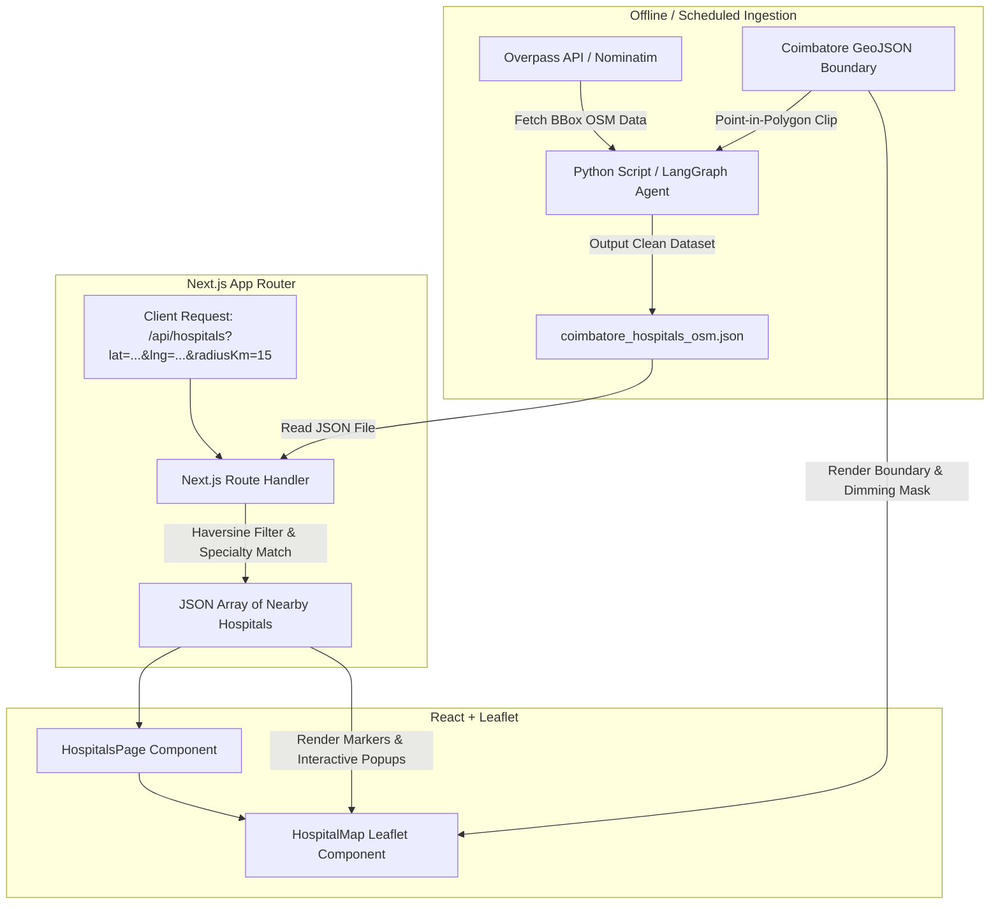
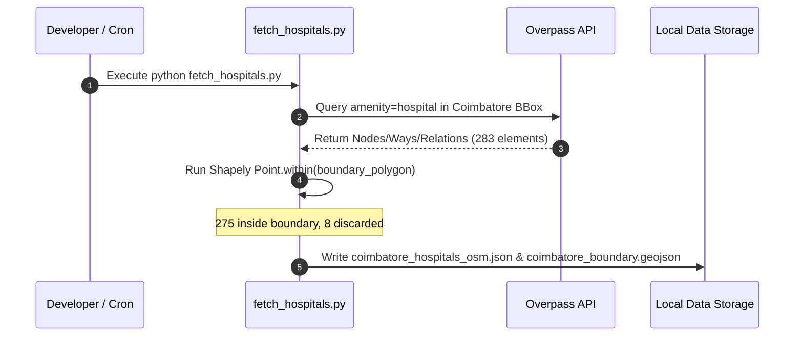
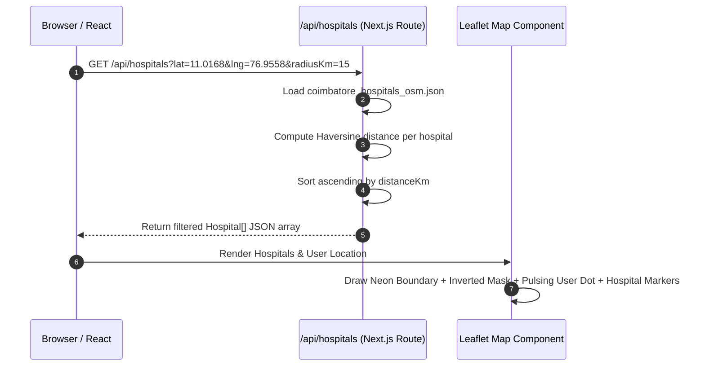

# 🗺️ Hospital Geospatial Mapping Component: Migration & Architecture Plan

This document outlines the **High-Level Design (HLD)**, **Low-Level Design (LLD)**, **System Architecture**, and **Step-by-Step Integration Workflow** for migrating the Hospital Mapping Engine into any Next.js or fullstack workspace using the newly created `migration_map` directory package.

---

## 🎯 1. Executive Summary

The **Geospatial Hospital Discovery Engine** isolates the official **Coimbatore Municipal Corporation (CMC)** boundary, queries Overpass OpenStreetMap (OSM) spatial data, applies strict point-in-polygon filtering, and renders an interactive satellite map with spatial isolation masks.

To ensure **drop-in portability** across projects, all essential components have been modularized into `migration_map/`:

```
migration_map/
├── data/
│   ├── coimbatore_boundary.geojson         # Official CMC municipal polygon boundary
│   └── coimbatore_hospitals_osm.json       # Point-in-polygon filtered hospital dataset
├── components/
│   └── HospitalMap.tsx                     # React/Leaflet satellite map with isolation mask
├── scripts/
│   └── agent_0_coimbatore_hospital_pipeline.py # Python/LangGraph spatial ingestion pipeline
├── api/
│   └── hospitals/
│       └── route.ts                         # Standalone Next.js Route Handler (/api/hospitals)
└── README.md                                # Quick-start integration guide
```

---

## 🏗️ 2. High-Level Design (HLD)

### System Architecture Overview



### Component Responsibilities

1. **Ingestion Engine (`scripts/`)**: Connects to OpenStreetMap Overpass API, computes minimum bounding box, executes Shapely `Point.within(boundary_polygon)`, and discards external hospitals.
2. **Data Repository (`data/`)**: Stores immutable, authoritative GeoJSON boundaries and filtered JSON spatial records.
3. **API Data Layer (`api/hospitals/route.ts`)**: Serves spatial queries to the frontend using Haversine distance calculations without external database dependencies.
4. **Interactive Map Component (`components/HospitalMap.tsx`)**: Renders Esri Satellite imagery, applies neon boundary outline (`#39ff14`), applies inverted polygon hole mask (dimming non-Coimbatore terrain by 65%), and animates user/hospital markers.

---

## 🔬 3. Low-Level Design (LLD)

### 3.1 Data Contracts & Schema

#### Hospital Schema (`coimbatore_hospitals_osm.json`)
```json
{
  "osm_id": "string",
  "name": "string",
  "lat": 11.0168,
  "lon": 76.9558,
  "phone": "string",
  "website": "string",
  "operator": "string",
  "emergency": "yes | no | unknown",
  "opening_hours": "24/7 | string",
  "addr:street": "string",
  "addr:city": "Coimbatore",
  "source": "OSM/Overpass"
}
```

### 3.2 Spatial Filtering Algorithms (LLD)

#### A. Point-in-Polygon Strict Filtering (Python / Shapely)
```python
from shapely.geometry import Point
import geopandas as gpd

gdf = gpd.read_file("coimbatore_boundary.geojson")
municipal_polygon = gdf.geometry.union_all()

# Retain point ONLY if inside polygon
is_inside = municipal_polygon.contains(Point(lon, lat)) or Point(lon, lat).within(municipal_polygon)
```

#### B. Haversine Distance Calculation (TypeScript / Route Handler)
```typescript
function haversineDistance(lat1: number, lon1: number, lat2: number, lon2: number): number {
  const R = 6371.0; // Earth radius in kilometers
  const dLat = (lat2 - lat1) * (Math.PI / 180);
  const dLon = (lon2 - lon1) * (Math.PI / 180);
  const a =
    Math.sin(dLat / 2) * Math.sin(dLat / 2) +
    Math.cos(lat1 * (Math.PI / 180)) * Math.cos(lat2 * (Math.PI / 180)) *
    Math.sin(dLon / 2) * Math.sin(dLon / 2);
  const c = 2 * Math.atan2(Math.sqrt(a), Math.sqrt(1 - a));
  return R * c;
}
```

### 3.3 Visual Map Mask Design (LLD - Leaflet Inverted Polygon)

To isolate Coimbatore visually on the satellite map, an **inverted polygon mask with a hole** is rendered over the map canvas:

```typescript
// Outer world boundary ring
const outerRing: [number, number][] = [
  [-90, -360], [90, -360], [90, 360], [-90, 360], [-90, -360]
];

// Inner ring = Coimbatore GeoJSON boundary coordinates
const innerRing = geoJsonCoordinates.map(c => [c[1], c[0]]);

// Polygon with hole creates 65% black overlay outside Coimbatore
L.polygon([outerRing, innerRing], {
  color: 'transparent',
  fillColor: '#000000',
  fillOpacity: 0.65
}).addTo(map);
```

---

## 🔄 4. Workflows & Integration Sequence

### A. Data Ingestion Sequence (Offline / Admin)



### B. Client Runtime Discovery Sequence



---

## 📋 5. Portability & Migration Execution Checklist

When copying `migration_map` into a brand new Next.js project, execute these 4 steps:

- [x] **Folder Copy**: Copy `migration_map/data/` into target app `public/data/`.
- [x] **Component Copy**: Copy `migration_map/components/HospitalMap.tsx` into target `src/components/features/`.
- [x] **API Copy**: Copy `migration_map/api/hospitals/` into target `src/app/api/`.
- [x] **Dependencies**: Run `npm install leaflet framer-motion lucide-react @types/leaflet`.

---

## ✋ 6. Next Steps & Approval Request

1. **Review**: Please review this **HLD, LLD, and Architecture Plan** along with the `migration_map` directory package prepared in your workspace.
2. **Approval**: Once approved, I can proceed to integrate the native Next.js API routes directly into your current application code or assist with any customizations!
